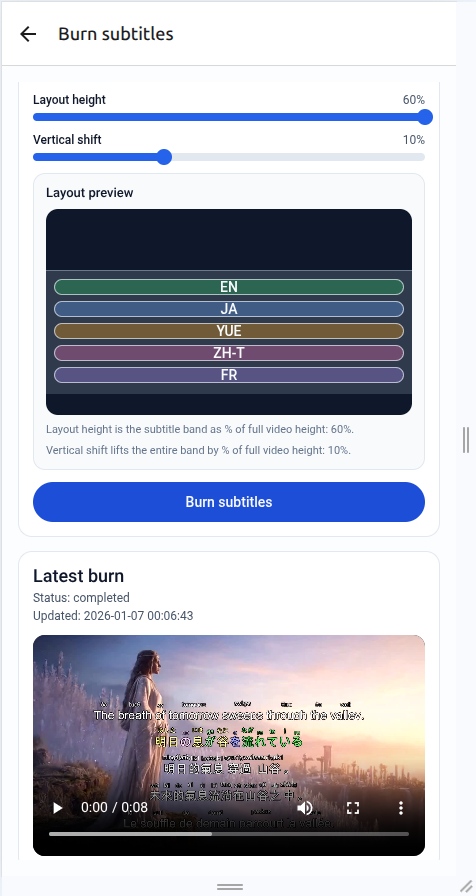

<p align="center">
  
</p>

<p>
  <b>Languages:</b>
  <a href="README.md">English</a>
  · <a href="i18n/README.zh-Hant.md">中文（繁體）</a>
  · <a href="i18n/README.zh-Hans.md">中文 (简体)</a>
  · <a href="i18n/README.ja.md">日本語</a>
  · <a href="i18n/README.ko.md">한국어</a>
  · <a href="i18n/README.vi.md">Tiếng Việt</a>
  · <a href="i18n/README.ar.md">العربية</a>
  · <a href="i18n/README.fr.md">Français</a>
  · <a href="i18n/README.es.md">Español</a>
</p>

# LazyEdit

LazyEdit is an AI-powered automatic video editing tool that processes videos to add professional-quality subtitles, highlights, word cards, and metadata. It streamlines the video editing workflow using advanced AI techniques to automate labor-intensive tasks.

## Features

- **Auto-Transcription**: Automatically transcribes video audio using AI
- **Auto-Caption**: Generates descriptive captions for video content
- **Auto-Subtitle**: Creates and burns subtitles directly onto videos
- **Auto-Highlight**: Identifies and visually highlights key words during playback
- **Auto-Metadata**: Extracts and generates metadata from video content
- **Word Cards**: Adds educational word cards for language learning
- **Teaser Generation**: Creates intelligent teasers by repeating key segments at the start
- **Multi-language Support**: Handles various languages including English and Chinese
- **Cover Image Generation**: Extracts optimal cover images with word overlays

## Demos

<table>
  <tr>
    <td align="center">
      
      <br /><sub>Home · Upload</sub>
    </td>
    <td align="center">
      
      <br /><sub>Home · Generate</sub>
    </td>
    <td align="center">
      
      <br /><sub>Home · Remix</sub>
    </td>
    <td align="center">
      
      <br /><sub>Library</sub>
    </td>
    <td align="center">
      
      <br /><sub>Video overview</sub>
    </td>
  </tr>
  <tr>
    <td align="center">
      
      <br /><sub>Translation preview</sub>
    </td>
    <td align="center">
      
      <br /><sub>Burn slots</sub>
    </td>
    <td align="center">
      
      <br /><sub>Burn layout</sub>
    </td>
    <td align="center">
      
      <br /><sub>Keyframes + captions</sub>
    </td>
    <td align="center">
      
      <br /><sub>Metadata generator</sub>
    </td>
  </tr>
</table>

## Installation

### Prerequisites

- Python 3.10 or higher
- FFmpeg
- CUDA-capable GPU (for transcription acceleration)
- Conda environment manager

### Installation Steps

1. Clone the repository:
   ```bash
   git clone <repository_url>
   cd lazyedit
   ```

2. Run the installation script:
   ```bash
   chmod +x install_lazyedit.sh
   ./install_lazyedit.sh
   ```

The installation script will:
- Install required system packages (ffmpeg, tmux)
- Create and configure a conda environment named "lazyedit"
- Set up the systemd service for automatic startup
- Configure necessary permissions

## Usage

LazyEdit runs as a web application that you can access at http://localhost:8081

### Processing a Video

1. Upload your video through the web interface
2. LazyEdit will automatically:
   - Transcribe and caption the video
   - Generate metadata and educational content
   - Create subtitles in detected languages
   - Add word highlighting for important terms
   - Create a teaser introduction
   - Generate a cover image
   - Package and return the processed content

### Command Line Usage

You can also run LazyEdit directly:

```bash
conda activate lazyedit
cd /path/to/lazyedit
python app.py -m lazyedit
```

## Project Structure

- `app.py` - Main application entry point
- `lazyedit/` - Core module directory
  - `autocut_processor.py` - Handles video segmentation and transcription
  - `subtitle_metadata.py` - Generates metadata from subtitles
  - `subtitle_translate.py` - Handles subtitle translation
  - `video_captioner.py` - Generates video captions
  - `words_card.py` - Creates educational word cards
  - `utils.py` - Utility functions
  - `openai_version_check.py` - OpenAI API compatibility layer

## Configuration

The systemd service configuration is created in `/etc/systemd/system/lazyedit.service`.

LazyEdit uses a tmux session named "lazyedit" to run the application, which allows it to continue running in the background.

## Service Management

- Start the service: `sudo systemctl start lazyedit.service`
- Stop the service: `sudo systemctl stop lazyedit.service`
- Check status: `sudo systemctl status lazyedit.service`
- View logs: `sudo journalctl -u lazyedit.service`

## Advanced Usage

LazyEdit supports customization of:
- Teaser length and placement
- Word highlighting styles
- Subtitle fonts and positioning
- Output folder structure
- GPU selection for processing

## Troubleshooting

- If the application doesn't start, check the systemd service status and logs
- If video processing fails, ensure FFmpeg is correctly installed
- For GPU-related issues, verify CUDA installation and GPU availability
- Ensure the conda environment is correctly activated by the service

## What your support makes possible

- <b>Keep tools open</b>: hosting, inference, data storage, and community ops.  
- <b>Ship faster</b>: weeks of focused open-source time on EchoMind, LazyEdit, and MultilingualWhisper.  
- <b>Prototype wearables</b>: optics, sensors, and neuromorphic/edge components for IdeasGlass + LightMind.  
- <b>Access for all</b>: subsidized deployments for students, creators, and community groups.

### Donate

<div align="center">
<table style="margin:0 auto; text-align:center; border-collapse:collapse;">
  <tr>
    <td style="text-align:center; vertical-align:middle; padding:6px 12px;">
      <a href="https://chat.lazying.art/donate">https://chat.lazying.art/donate</a>
    </td>
    <td style="text-align:center; vertical-align:middle; padding:6px 12px;">
      <a href="https://chat.lazying.art/donate"></a>
    </td>
  </tr>
  <tr>
    <td style="text-align:center; vertical-align:middle; padding:6px 12px;">
      <a href="https://paypal.me/RongzhouChen">
        
      </a>
    </td>
    <td style="text-align:center; vertical-align:middle; padding:6px 12px;">
      <a href="https://buy.stripe.com/aFadR8gIaflgfQV6T4fw400">
        
      </a>
    </td>
  </tr>
  <tr>
    <td style="text-align:center; vertical-align:middle; padding:6px 12px;"><strong>WeChat</strong></td>
    <td style="text-align:center; vertical-align:middle; padding:6px 12px;"><strong>Alipay</strong></td>
  </tr>
  <tr>
    <td style="text-align:center; vertical-align:middle; padding:6px 12px;"></td>
    <td style="text-align:center; vertical-align:middle; padding:6px 12px;"></td>
  </tr>
</table>
</div>

**支援 / Donate**

- ご支援は研究・開発と運用の継続に役立ち、より多くのオープンなプロジェクトを皆さんに届ける力になります。  
- 你的支持将用于研发与运维，帮助我持续公开分享更多项目与改进。  
- Your support sustains my research, development, and ops so I can keep sharing more open projects and improvements.

## License

[Specify your license here]

## Acknowledgements

LazyEdit uses several open-source libraries and tools including:
- FFmpeg for video processing
- OpenAI models for AI capabilities
- Tornado web framework
- MoviePy for video editing
- CJKWrap for multilingual text processing
