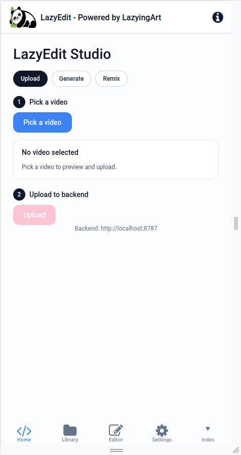
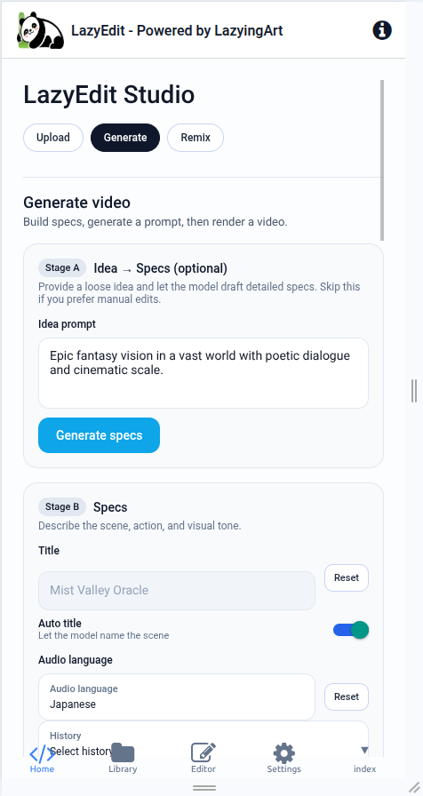
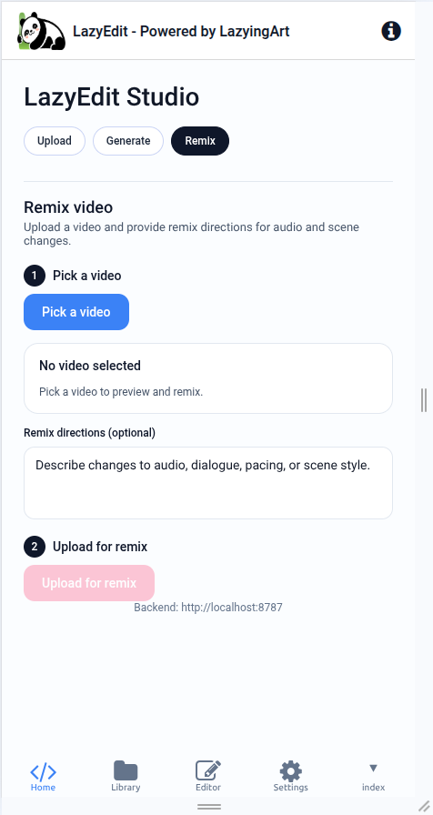
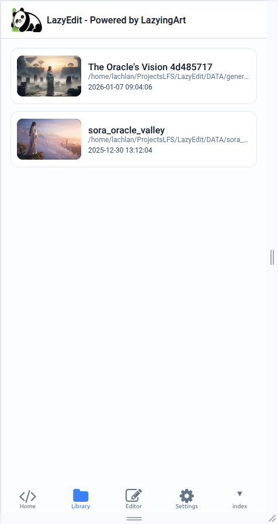
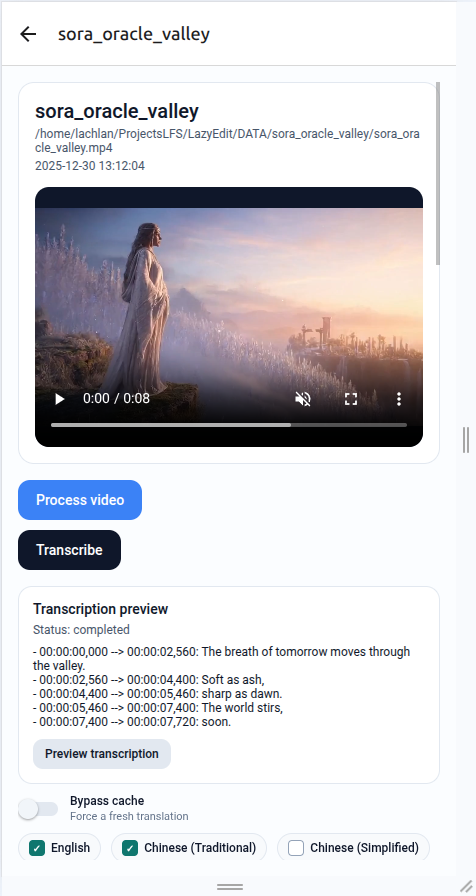
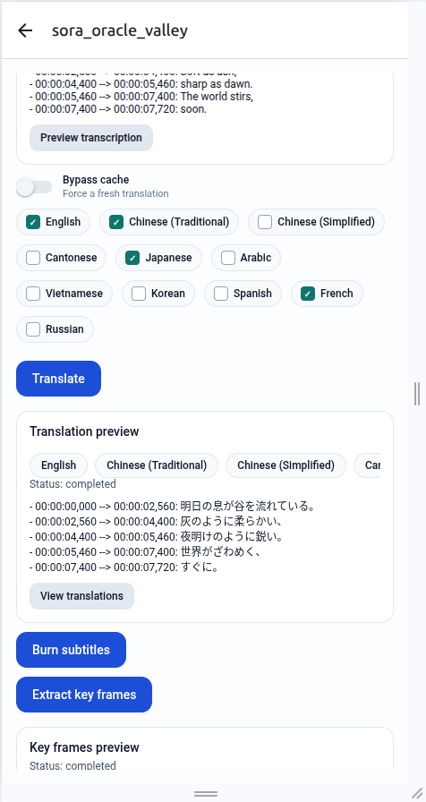
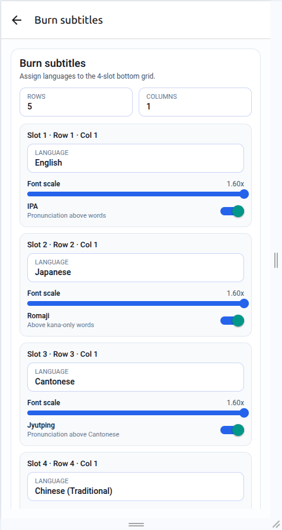
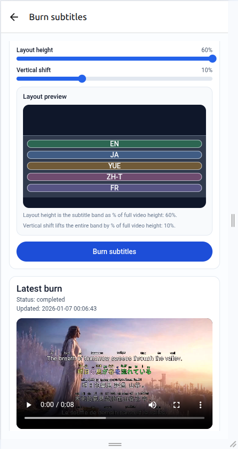
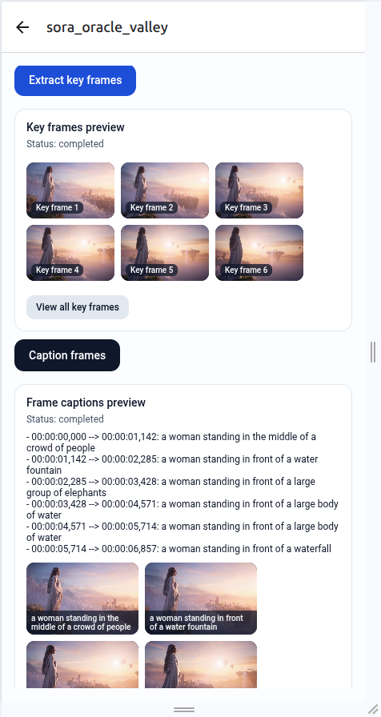
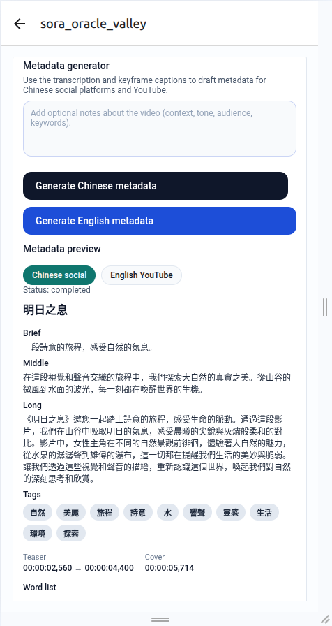

[English](README.md) · [العربية](i18n/README.ar.md) · [Español](i18n/README.es.md) · [Français](i18n/README.fr.md) · [日本語](i18n/README.ja.md) · [한국어](i18n/README.ko.md) · [Tiếng Việt](i18n/README.vi.md) · [中文 (简体)](i18n/README.zh-Hans.md) · [中文（繁體）](i18n/README.zh-Hant.md) · [Deutsch](i18n/README.de.md) · [Русский](i18n/README.ru.md)

<p align="center">
  
</p>

<p align="center">
  <a href="LICENSE"></a>
  
  
  
  
  
  
  
</p>


# LazyEdit

LazyEdit is an end-to-end AI-assisted video workflow for creation, processing, and optional publishing. It combines prompt-based generation (Stage A/B/C), media processing APIs, subtitle rendering, keyframe captioning, metadata generation, and AutoPublish handoff.

## ✨ Overview

LazyEdit is built around a Tornado backend (`app.py`) and an Expo frontend (`app/`).

| Step | What happens |
| --- | --- |
| 1 | Upload or generate video |
| 2 | Transcribe and optionally translate subtitles |
| 3 | Burn multilingual subtitles with layout controls |
| 4 | Generate keyframes, captions, and metadata |
| 5 | Package and optionally publish via AutoPublish |

### Pipeline focus

- Upload, generation, remix, and library management from a single operator UI.
- API-first processing flow for transcription, subtitle polish/translation, burn-in, and metadata.
- Optional generation-provider integrations (Veo / Venice / A2E / Sora helpers in `agi/`).
- Optional publish handoff through `AutoPublish`.

## 🎯 At a Glance

| Area | Included in LazyEdit |
| --- | --- |
| Core app | Tornado API backend + Expo web/mobile frontend |
| Media pipeline | ASR, subtitle translation/polish, burn-in, keyframes, captions, metadata |
| Generation | Stage A/B/C and provider helper routes (`agi/`) |
| Distribution | Optional AutoPublish handoff |
| Runtime model | Local-first scripts, tmux workflows, optional systemd service |

## 🎬 Demos

<table>
  <tr>
    <td align="center">
      
      <br /><sub>Home · Upload</sub>
    </td>
    <td align="center">
      
      <br /><sub>Home · Generate</sub>
    </td>
    <td align="center">
      
      <br /><sub>Home · Remix</sub>
    </td>
    <td align="center">
      
      <br /><sub>Library</sub>
    </td>
    <td align="center">
      
      <br /><sub>Video overview</sub>
    </td>
  </tr>
  <tr>
    <td align="center">
      
      <br /><sub>Translation preview</sub>
    </td>
    <td align="center">
      
      <br /><sub>Burn slots</sub>
    </td>
    <td align="center">
      
      <br /><sub>Burn layout</sub>
    </td>
    <td align="center">
      
      <br /><sub>Keyframes + captions</sub>
    </td>
    <td align="center">
      
      <br /><sub>Metadata generator</sub>
    </td>
  </tr>
</table>

## 🧩 Features

- Prompt-based generation workflow (Stage A/B/C) with Sora and Veo integration paths.
- Full processing pipeline: transcription -> subtitle polish/translation -> burn-in -> keyframes -> captions -> metadata.
- Multilingual subtitle composition with furigana/IPA/romaji-related support paths.
- API-first backend with upload, processing, media serving, and publish queue endpoints.
- Optional AutoPublish integration for social-platform handoff.
- Combined backend + Expo workflow supported via tmux launch scripts.

## 🗂️ Project Structure

```text
LazyEdit/
├── app.py                           # Tornado backend entrypoint and API orchestration
├── app/                             # Expo frontend (web/mobile)
├── lazyedit/                        # Core pipeline modules (translation, metadata, burner, DB, templates)
├── agi/                             # Generation provider abstraction (Sora/Veo/A2E/Venice routes)
├── DATA/                            # Runtime media input/output (symlink in this workspace)
├── translation_logs/                # Translation logs
├── temp/                            # Temporary runtime files
├── install_lazyedit.sh              # systemd installer (expects config/start/stop scripts)
├── start_lazyedit.sh                # tmux launcher for backend + Expo
├── stop_lazyedit.sh                 # tmux stop helper
├── lazyedit_config.sh               # Deployment/runtime shell config
├── config.py                        # Environment/config resolution (ports, paths, autopublish URL)
├── .env.example                     # Environment override template
├── references/                      # Additional docs (API guide, quickstart, deployment notes)
├── AutoPublish/                     # Submodule (optional publishing pipeline)
├── AutoPubMonitor/                  # Submodule (monitor/sync automation)
├── whisper_with_lang_detect/        # Submodule (ASR/VAD)
├── vit-gpt2-image-captioning/       # Submodule (primary captioner)
├── clip-gpt-captioning/             # Submodule (fallback captioner)
└── furigana/                        # External dependency in workflow (tracked submodule in this checkout)
```

## ✅ Prerequisites

| Dependency | Notes |
| --- | --- |
| Linux environment | `systemd`/`tmux` scripts are Linux-oriented |
| Python 3.10+ | Use Conda env `lazyedit` |
| Node.js 20+ + npm | Required for Expo app in `app/` |
| FFmpeg | Must be available on `PATH` |
| PostgreSQL | Local peer auth or DSN-based connection |
| Git submodules | Required for key pipelines |

## 🚀 Installation

1. Clone and initialize submodules:

```bash
git clone git@github.com:lachlanchen/LazyEdit.git
cd LazyEdit
git submodule update --init --recursive
```

2. Activate Conda environment:

```bash
source ~/miniconda3/etc/profile.d/conda.sh
conda activate lazyedit
```

3. Optional system-level install (service mode):

```bash
chmod +x install_lazyedit.sh
sudo ./install_lazyedit.sh /path/to/lazyedit
```

Service install notes:
- `install_lazyedit.sh` installs `ffmpeg` and `tmux`, then creates `lazyedit.service`.
- It does not generate `lazyedit_config.sh`, `start_lazyedit.sh`, or `stop_lazyedit.sh`; these must already exist and be correct.

## 🛠️ Usage

### Development: backend only

```bash
source ~/miniconda3/etc/profile.d/conda.sh
conda activate lazyedit
python app.py
```

Alternate entry used in current deployment scripts:

```bash
python app.py -m lazyedit
```

Backend default URL: `http://localhost:8787` (from `config.py`, override with `PORT` or `LAZYEDIT_PORT`).

### Development: backend + Expo app (tmux)

```bash
./start_lazyedit.sh
```

Default `start_lazyedit.sh` ports:
- Backend: `18787`
- Expo web: `18791`
- `EXPO_PUBLIC_API_URL=http://localhost:18787`

Attach to session:

```bash
tmux attach -t lazyedit
```

Stop session:

```bash
./stop_lazyedit.sh
```

### Service management

```bash
sudo systemctl start lazyedit.service
sudo systemctl stop lazyedit.service
sudo systemctl status lazyedit.service
sudo journalctl -u lazyedit.service
```

## ⚙️ Configuration

Copy `.env.example` to `.env` and update paths/secrets:

```bash
cp .env.example .env
```

### Key variables

| Variable | Purpose | Default/Fallback |
| --- | --- | --- |
| `PORT`, `LAZYEDIT_PORT` | Backend port | `8787` |
| `LAZYEDIT_UPLOAD_DIR` | Media root directory | `DATA/` |
| `LAZYEDIT_DATABASE_URL`, `DATABASE_URL` | PostgreSQL DSN | Local DB fallback `lazyedit_db` |
| `LAZYEDIT_AUTOPUBLISH_URL` | AutoPublish endpoint | `http://localhost:8081/publish` |
| `LAZYEDIT_AUTOPUBLISH_TIMEOUT` | AutoPublish request timeout (seconds) | `60` |
| `LAZYEDIT_WHISPER_SCRIPT` | Whisper/VAD script path | Environment-dependent |
| `LAZYEDIT_WHISPER_MODEL`, `LAZYEDIT_WHISPER_FALLBACK_MODEL` | ASR model names | `large-v3` / `large-v2` (example) |
| `LAZYEDIT_CAPTION_PYTHON` | Python runtime for caption pipeline | Environment-dependent |
| `LAZYEDIT_CAPTION_PRIMARY_ROOT`, `LAZYEDIT_CAPTION_PRIMARY_SCRIPT` | Primary captioning path/script | Environment-dependent |
| `LAZYEDIT_CAPTION_FALLBACK_SCRIPT`, `LAZYEDIT_CAPTION_FALLBACK_CWD` | Fallback captioning path/script/cwd | Environment-dependent |
| `GRSAI_API_*` | Veo/GRSAI integration settings | Environment-dependent |
| `VENICE_*`, `A2E_*` | Venice/A2E integration settings | Environment-dependent |
| `OPENAI_API_KEY` | Required for OpenAI-backed features | None |

Machine-specific notes:
- `app.py` may set CUDA behavior (`CUDA_VISIBLE_DEVICES` usage in codebase context).
- Some paths in defaults are workstation-specific; use `.env` overrides for portable setups.
- `lazyedit_config.sh` controls tmux/session startup variables for deployment scripts.

## 🔌 API Examples

Base URL examples assume `http://localhost:8787`.

Upload:

```bash
curl -F "video=@/path/to/video.mp4" \
     -F "title=my_video" \
     -F "filename=video.mp4" \
     -F "source=api" \
     http://localhost:8787/upload
```

End-to-end process:

```bash
curl -X POST \
  -d "file_path=/abs/path/to/DATA/my_video/video.mp4" \
  -d "use_translation_cache=true" \
  -d "use_metadata_cache=true" \
  http://localhost:8787/video-processing
```

List videos:

```bash
curl http://localhost:8787/api/videos
```

Publish package:

```bash
curl -X POST \
  -H "Content-Type: application/json" \
  -d '{"platforms":{"xiaohongshu":true,"douyin":true}}' \
  http://localhost:8787/api/videos/123/publish
```

More endpoints and payload details: `references/API_GUIDE.md`.

## 🧪 Examples

### Frontend local run (web)

```bash
cd app
npm install
EXPO_PUBLIC_API_URL="http://localhost:8787" npx expo start --web --port 8091
```

If backend is on `8887`:

```bash
EXPO_PUBLIC_API_URL="http://localhost:8887" npx expo start --web --port 8091
```

### Android emulator

```bash
EXPO_PUBLIC_API_URL="http://10.0.2.2:8787" npx expo start --android
```

### iOS simulator (macOS)

```bash
EXPO_PUBLIC_API_URL="http://127.0.0.1:8787" npx expo start --ios
```

### Optional Sora generation helper

```bash
python -m agi.demo_fantasy_woman --seconds 8 --size 1280x720 --output DATA/sora_oracle_valley.mp4
```

Supported seconds: `4`, `8`, `12`.
Supported sizes: `720x1280`, `1280x720`, `1024x1792`, `1792x1024`.

## 🧪 Development Notes

- Use `python` from Conda env `lazyedit` (do not assume system `python3`).
- Keep large media out of Git; store runtime media in `DATA/` or external storage.
- Initialize/update submodules whenever pipeline components fail to resolve.
- Keep edits scoped; avoid unrelated large-formatting changes.
- For frontend work, backend API URL is controlled by `EXPO_PUBLIC_API_URL`.
- CORS is open on the backend for app development.

Submodule and external dependency policy:
- Treat external dependencies as upstream-owned. In this repository workflow, avoid editing submodule internals unless intentionally working in those projects.
- Operational guidance in this repo treats `furigana` (and sometimes `echomind` in local setups) as external dependency paths; if uncertain, preserve upstream and avoid in-place edits.

Helpful references:
- `references/QUICKSTART.md`
- `references/API_GUIDE.md`
- `references/APP_GUIDE.md`
- `references/DEPLOYMENT_SYSTEMS.md`
- `references/TMUX_SESSIONS.md`

## ✅ Testing

Current formal test surface is minimal and DB-oriented.

```bash
python db_smoke_test.py
pytest tests/test_db_smoke.py
```

For functional validation, use the web UI and API flow with a short sample clip in `DATA/`.

## 🚢 Deployment & Sync Notes

Current known paths and sync flow (from repository operations docs):

- Development workspace: `/home/lachlan/ProjectsLFS/LazyEdit`
- Deployed LazyEdit backend + app: `/home/lachlan/DiskMech/Projects/lazyedit`
- Deployed AutoPubMonitor: `/home/lachlan/DiskMech/Projects/autopub-monitor`
- Publishing system host: `/home/lachlan/Projects/auto-publish` on `lazyingart`

After pushing `AutoPublish/` updates from this repo, pull on publishing host:

```bash
ssh lachlan@lazyingart
cd ~/Projects/auto-publish
git pull github main
```

## 🧯 Troubleshooting

| Problem | Check / Fix |
| --- | --- |
| Missing pipeline modules or scripts | Run `git submodule update --init --recursive` |
| FFmpeg not found | Install FFmpeg and confirm `ffmpeg -version` works |
| Port conflicts | Backend defaults to `8787`; `start_lazyedit.sh` defaults to `18787`; set `LAZYEDIT_PORT` or `PORT` explicitly |
| Expo cannot reach backend | Ensure `EXPO_PUBLIC_API_URL` points to active backend host/port |
| Database connection issues | Verify PostgreSQL + DSN/env vars; optional smoke check: `python db_smoke_test.py` |
| GPU/CUDA issues | Confirm driver/CUDA compatibility with installed Torch stack |
| Service script fails at install | Ensure `lazyedit_config.sh`, `start_lazyedit.sh`, and `stop_lazyedit.sh` exist before running installer |

## 🗺️ Roadmap

- In-app subtitle/segment editing with A/B preview and per-line controls.
- Stronger end-to-end test coverage for core API flows.
- Documentation convergence across i18n README variants and deployment modes.
- Additional workflow hardening for generation-provider retries and status visibility.

## 🤝 Contributing

Contributions are welcome.

1. Fork and create a feature branch.
2. Keep commits focused and scoped.
3. Validate changes locally (`python app.py`, key API flow, and app integration if relevant).
4. Open a PR with purpose, reproduction steps, and before/after notes (screenshots for UI changes).

Practical guidelines:
- Follow Python style (PEP 8, 4 spaces, snake_case naming).
- Avoid committing credentials or large binaries.
- Update docs/config scripts when behavior changes.
- Preferred commit style: short, imperative, scoped (for example: `fix ffmpeg 7 compatibility`).

## ❤️ What your support makes possible

- <b>Keep tools open</b>: hosting, inference, data storage, and community ops.  
- <b>Ship faster</b>: weeks of focused open-source time on EchoMind, LazyEdit, and MultilingualWhisper.  
- <b>Prototype wearables</b>: optics, sensors, and neuromorphic/edge components for IdeasGlass + LightMind.  
- <b>Access for all</b>: subsidized deployments for students, creators, and community groups.

### Donate

<div align="center">
<table style="margin:0 auto; text-align:center; border-collapse:collapse;">
  <tr>
    <td style="text-align:center; vertical-align:middle; padding:6px 12px;">
      <a href="https://chat.lazying.art/donate">https://chat.lazying.art/donate</a>
    </td>
    <td style="text-align:center; vertical-align:middle; padding:6px 12px;">
      <a href="https://chat.lazying.art/donate"></a>
    </td>
  </tr>
  <tr>
    <td style="text-align:center; vertical-align:middle; padding:6px 12px;">
      <a href="https://paypal.me/RongzhouChen">
        
      </a>
    </td>
    <td style="text-align:center; vertical-align:middle; padding:6px 12px;">
      <a href="https://buy.stripe.com/aFadR8gIaflgfQV6T4fw400">
        
      </a>
    </td>
  </tr>
  <tr>
    <td style="text-align:center; vertical-align:middle; padding:6px 12px;"><strong>WeChat</strong></td>
    <td style="text-align:center; vertical-align:middle; padding:6px 12px;"><strong>Alipay</strong></td>
  </tr>
  <tr>
    <td style="text-align:center; vertical-align:middle; padding:6px 12px;"></td>
    <td style="text-align:center; vertical-align:middle; padding:6px 12px;"></td>
  </tr>
</table>
</div>

**支援 / Donate**

- ご支援は研究・開発と運用の継続に役立ち、より多くのオープンなプロジェクトを皆さんに届ける力になります。  
- 你的支持将用于研发与运维，帮助我持续公开分享更多项目与改进。  
- Your support sustains my research, development, and ops so I can keep sharing more open projects and improvements.

## 📄 License

[Apache-2.0](LICENSE)

## 🙏 Acknowledgements

LazyEdit builds on open-source libraries and services, including:
- FFmpeg for media processing
- Tornado for backend APIs
- MoviePy for editing workflows
- OpenAI models for AI-assisted pipeline tasks
- CJKWrap and multilingual text tooling in subtitle workflows
