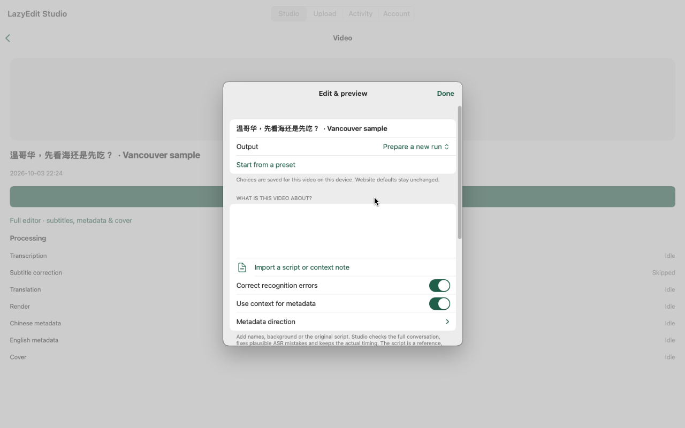
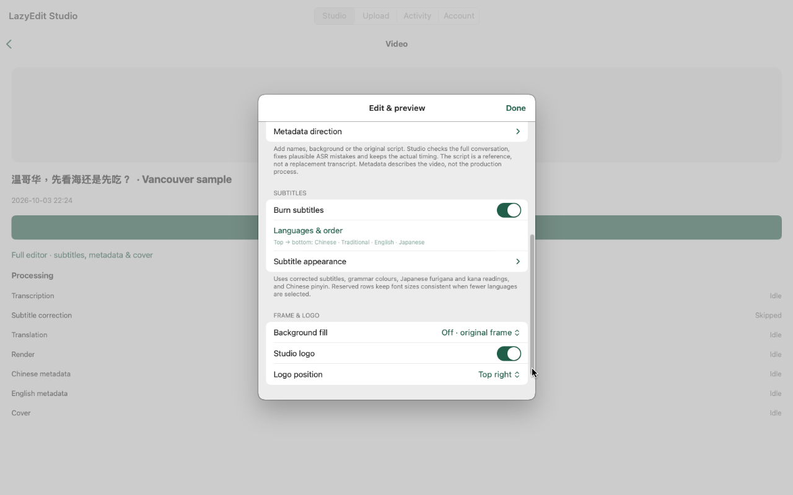

# LazyEdit Studio: response to App Review

LazyingArt LLC | 6 October 2026 | App ID 6814061525

Applies to iOS 1.0 (9) and macOS 1.0 (12), the latest qualified builds for
their respective platforms. Thank you for explaining the concerns under
4.3 and 4.2.6. We are answering your nine questions and requesting
reconsideration through the existing review threads, as instructed, rather
than submitting an unchanged binary as a new review.

## 1. Function and primary problem

The input is a user's own recorded video, not a catalog of videos supplied
by us. The output is an edited, playable video with synchronized multilingual
captions, optional pronunciation guides, and a user-reviewed layout.

After importing from Photos or Files, the user can add a context note with
names or what was discussed. The server transcribes the actual audio and uses
that context to correct plausible recognition mistakes. The reference must
not replace the recorded speech or its timing. The user chooses caption
languages and order, pronunciation annotations, font/outline settings, logo
position, and whether to retain the original frame or use a portrait background
where the source geometry allows it. A native review step precedes processing.
The app then shows processing progress and plays the finished result. The
advanced editor exposes detailed transcript, metadata and cover controls.

The problem is preserving both timing and readability when one recording needs
several language layers. Japanese kanji readings and Chinese pinyin require
space above the main text; multiple lines need consistent sizing and wrapping.
Studio treats those as part of the same render, rather than separate text
overlays the user must manually align. A completed run can be inspected and
reused without retranscribing the original.

Video processing and AI calls run on our authenticated service, not on-device.
The native client supplies import, configuration, review, progress, playback
and account controls. Internet and an invited Studio account are required.
Social posting is an optional operator-enabled integration for approved
accounts; ordinary members can finish and preview edits without social login.
This restriction is the ordinary account policy, not a review-only mode.

## 2. Intended users

The initial audience is invited independent creators and language educators
who record conversations, demonstrations, travel observations or short
instructional videos for audiences reading different languages. A concrete
case is a Chinese recording prepared with English, Japanese and Chinese
captions, Japanese readings and Chinese pinyin. Another is a creator who
already has captions and wants only a logo or a different frame layout.

These users bring their own media and background knowledge. They need to
check recognition errors and preview the finished edit; they are not using
the app to consume our music/books, practise isolated sounds or chat with an
assistant. The first service release is an invitation-only pilot with bounded
processing capacity, not unrestricted public registration.

## 3. Specific need and differentiation

We do not claim that other editors cannot caption or translate videos. Our
focus is the combined workflow of context-assisted ASR correction, several
simultaneously timed subtitle languages, reading annotations and grammar
colors, followed by a reproducible video render and preview.

The layout reserves rows independently of the selected language count, so
removing a language need not unexpectedly enlarge the others. Ruby/readings
are positioned separately from main text. Portrait background geometry is
computed before submission; an already matching portrait frame cannot acquire
nonexistent top/bottom space. Context for recognition and direction for the
video description are separate controls. Saved runs and stable submission
identities help a network retry retrieve the same operation rather than
silently create another one. These are implemented editing behaviors, not a
new color theme or a different content collection in another product.

<!-- pagebreak -->

## 4. Beta testing and changes from feedback

The beta was small: one internal TestFlight participant, the developer/owner,
plus developer-run automated and interactive qualification. We are not
claiming a large independent or public beta cohort.

Examples of actual feedback incorporated before the submitted releases:

- Tab navigation could display a React object-rendering error, and login could
  briefly show a blank screen. Error normalization/loading recovery were
  repaired. The app subsequently moved its main navigation, library, upload,
  activity and account interface to SwiftUI rather than relying on the web
  editor as its primary screen.
- The owner requested ordinary editing choices without repeatedly opening
  the detailed web editor. Native controls were added for context import,
  correction, subtitle order/readings, font and outline, logo, layout planning
  and a final preparation review. Swipe removal became reversible, with
  full-swipe deletion disabled.
- Feedback about repeated publication and mismatched settings after retries
  led to saved request identities, review of the resolved settings and reuse
  of finished runs. This does not make an unknown server result a success;
  the client keeps the original receipt for reconciliation.
- The owner clarified that editing and preview must work without supplying
  personal social accounts. The submitted release gives ordinary invited
  members that workflow, with backend-enforced isolation and separately
  enabled publication. The review account has the same editing permissions.

Qualification records include a signed iOS simulator test exercising import,
upload, preview, context entry, review, draft persistence, advanced-editor
navigation and remove/restore (21 September, one test, no failures or skips).
The final iOS 9 qualification exercised ordinary-member sign-in, private
library, native editing, full editor without publication controls and sign-out
on iPhone and iPad simulators. The iPad run recorded one passing test in
108.870 seconds. These are simulator results, not a claim of testing on every
physical device.

Mac 12 was qualified on an Intel Mac environment with the exact candidate
executable in a separately development-signed copy: sign-in, private library,
native composer, loaded advanced editor, Keychain relaunch and logout. The
store archive was not modified. Earlier Mac launch checks used build 9 on
Intel and Apple Silicon machines; we do not represent those as full Mac 12
tests on every machine. Mac 12 is universal x86_64/arm64.

On 6 October, after this rejection, we also rechecked the existing review
account and its completed sample through the live API. Login, editing-only
permissions, metadata, and authenticated rendered-video retrieval remained
available. This is supplementary evidence, not pre-submission beta feedback.

## 5. Standalone product and portfolio relationship

Studio is a standalone video-editing product. No other app from our account
is required to upload, configure, process or preview a video. The iOS and Mac
submissions are platforms of the same Studio App Store record, not separately
branded variants.

Other products in our developer portfolio serve different workflows. The
next page identifies their scopes individually, including draft records so
that the comparison does not imply they are all already approved. Optional
LightMind/GlassAgent linking can send media to Studio's editing service with
the user's authorization. It does not turn Studio into a smart-glasses app.

## 6. Why not an addition to another app?

In principle, software can be combined. Delivering this entire workflow in
another product would require adding its video import/library, lengthy render
jobs, contextual transcript editor, synchronized caption layout, media storage
and preview lifecycle. It is not a content pack, alternate language or paid
unlock of a video editor already present in our other apps.

For example, Bunko's object is a book and reading position; AiMemo's is a note;
EchoMind's is a conversation; Musia's is a music practice session. Studio's
object is a source video and its prepared render runs. We keep Studio separate
so users can edit their own recordings without adopting those unrelated
accounts, content libraries or learning workflows. An optional API link is
interoperability, not a requirement to purchase a companion product.

<!-- pagebreak -->

## Portfolio comparison supporting questions 5 and 6

These descriptions were checked against our App Store Connect records on
6 October. Records without a current description are identified as such;
this is not a list of claimed public releases.

- **EchoMind: Language & Research:** AI text/voice conversations, optional
  language enhancement and community communication. Studio instead processes
  user-imported video into timed, rendered caption layers.
- **AiMemo: AI Notes & Voice:** capture, organize, search and revise notes and
  tasks. Studio's durable media/render workflow is not memo capture.
- **OnlyIdeas:** research-paper conversion, reading, discussion and questions
  over documents. It does not provide Studio's video-editing workspace.
- **Bunko: Classics with Ruby:** a rights-cleared book library, offline reading
  and reading annotations. Its text readings and Studio's pronunciation
  guides share an educational aim, but books are not timed video renders.
- **GlassAgent:** personal context and optional smart-glasses/hardware
  workflows. Studio neither requires glasses nor implements device control.
- **Musia: Learn Music & Guitar:** music listening, rhythm/chord practice,
  loops and play-along. Studio edits imported videos; it is not a song catalog
  or instrument-practice app.
- **L & N: Speech Practice:** listening contrasts, pronunciation recordings
  and practice feedback in English, Mandarin and Cantonese. Studio does not
  score pronunciation drills.
- **ClearPair Japanese:** kana distinctions, reading/mora and script practice.
- **ClearPair Korean:** Hangul shapes and Korean sound-family practice.
- **ClearPair Mandarin:** Mandarin consonants, finals, aspiration and tones.
- **ClearPair Cantonese:** Cantonese tones, vowels, finals and contrast practice.
- **ClearPair English:** English vowel and consonant contrast practice.
- **ClearPair L & R:** focused English L/R contrast practice.
- **ClearPair H & F:** focused H/F contrast practice and a separate F/V lesson.
- **ClearPair Arabic Letters:** letter shapes, dots, joining and optional
  device-voice listening. Each ClearPair record is a pronunciation or script
  practice product; none supplies Studio's import/render/editing workflow.
- **LazyOracle: Atlas & Notebook:** traditional symbolic-system exploration
  and personal reflection records, not media preparation.
- **LazyArtCoin:** account/credit and public Ethereum-balance companion,
  not a video editor, exchange or source of Studio editing content.
- **SHI: The Shape of Power:** an offline historical strategy narrative with
  decisions and campaign state, not an editing tool.
- **LazyGame, weStory and Auspice: Almanac Tarot BaZi:** additional developer
  records with no current English version description in this audit. They
  are not dependencies of Studio or alternate Studio content editions; we
  are not making an unverified claim about their release state or features.

<!-- pagebreak -->

## 7. Shared code, frameworks and assets within our account

The iOS and Mac versions of Studio deliberately share the same native Studio
source: StudioAPI handles HTTPS/session and upload requests; StudioStore
handles account-scoped media/draft/progress state; StudioViews provides the
library, import, playback and account screens; StudioComposer provides
video-specific correction, layout, subtitle and preparation review controls.
They are two platforms of this same app, not frameworks embedded to create
several rebranded Studio apps.

Across our products, we reuse standard authentication, secure session,
localization and StoreKit patterns, common company branding, and operational
infrastructure. Studio's dormant subscription support follows patterns used
for EchoMind, AiMemo and OnlyIdeas; it does not supply their product screens
or content. Purchases remain disabled in this invited editing pilot. Studio
uses a dedicated app icon; the configured video logo may use our LazyingArt
brand. We do not claim that every routine helper or design convention is
unique.

The backend uses our existing LazyEdit processor and related first-party
transcription/annotation/publishing tools. Language-enhancement conventions
also exist in EchoMind and our book workflows. Studio applies these to timed
video cues and rendered output. The optional AutoPublish integration is a
server-side service, not a bundled collection of another app's screens.
First-party LazyEdge infrastructure transports authenticated requests to the
processing host. Sharing that infrastructure does not share users' libraries.

The active native source audit found no whole-file Swift copies in the checked
EchoMind, AiMemo, OnlyIdeas, Bunko, GlassAgent, Musia, L & N and pronunciation
repositories. This is a bounded whole-file check, not a claim of zero common
algorithms. Both submitted archives' load commands list Apple system/Swift
libraries and no embedded third-party dynamic framework. Their main interface
uses SwiftUI/UIKit, AVKit, PhotosUI/Files, Keychain and URLSession. The detailed
editor remains a disclosed secondary authenticated WKWebView.

## 8. Third-party code or content

We did not purchase or license another app's product codebase or a white-label
video-editor template. Earlier mobile scaffolding used open-source Capacitor;
legacy configuration/resources remain in the source/archive. The submitted
native Studio target does not link the Capacitor/Cordova runtime or launch
its bridge as the main interface. We disclose this history rather than
claiming the project never used a cross-platform scaffold.

On the server, standard open-source components include Python/Tornado,
FFmpeg/libass for media/caption rendering and Whisper-based transcription.
Configured AI providers assist with recognition correction, translation and
metadata; these operations are not performed locally by the iOS/Mac binary.
Our original implementation supplies the source/cue data flow, correction
contracts, annotation validation, multilingual row/ruby layout, portrait
geometry, persisted render choices, review and authenticated run retrieval.
It does not merely show an external AI website.

Users supply their own source videos. The included Vancouver sample is an
owner-authorized example for trying the editor. Studio does not republish a
third-party media/content library as the app. No client brand or commercial
app-generation service supplies the product.

## 9. Content provider and developer identity

LazyEdit Studio is our own product, developed and operated by LazyingArt LLC
and submitted under our developer account. It was not commissioned as a
white-label app for a client or partner. Our company supplies the Studio
concept, branding and service; users supply their own media for editing.
There is no separate client/content provider on whose behalf we are
submitting. Optional service integrations do not transfer product ownership.

<!-- pagebreak -->

## Review walkthrough and evidence

Use the existing demo credentials in App Review Information; the account
already has an invitation and needs no social account. Select **Private
workspace**, sign in, and open the Vancouver sample in **Studio** (or import
a small video through **Upload**). Choose **Edit & preview** to see native
context/correction, caption, logo and layout controls. **Full editor** exposes
detailed subtitle, metadata and cover editing. Review the choices before
preparing a run; use the completed video's preview to inspect the render.
The completed small reviewer fixture also provides an immediate rendered
artifact. No public post is required to assess the editor.

The screenshots below are genuine Mac 12 qualification captures already
used for the Mac listing, not UI mockups. The iOS listing has its own genuine
native screenshots. Our native clients operate the same editing API while
using their platform's import and playback controls.

We would appreciate reconsideration of iOS 1.0 (9) and Mac 1.0 (12) based on
these details. If a particular existing app, duplicated component or missing
editing behavior caused the concern, please identify it so we can address
that specific issue. We have not created a new submission to bypass this
conversation.
